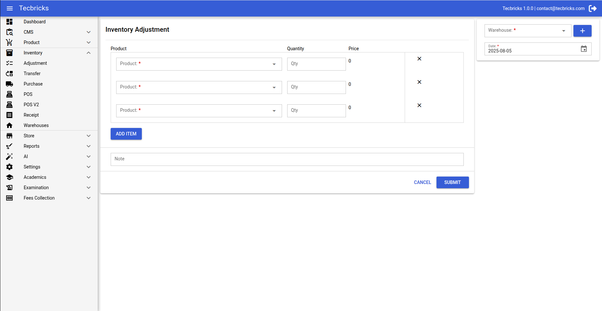

# Quasar Extreme Admin Template

## Proudly serving over 2+ happy customers and counting! 🚀🚀🚀

Introducing Quasar Extreme Admin Template – Your Ultimate Solution for a Powerful and Elegant Dashboard!

Quasar Extreme Template – Empowering Developers with an Exceptional Vue.js Admin Dashboard

Unlock the full potential of your development projects with the Quasar Extreme Template – a Vue.js Admin Dashboard that
sets the standard for developer-friendly interfaces. Meticulously crafted to adhere to the highest industry standards,
this template combines speed, usability, and scalability, providing an unparalleled foundation for creating dynamic and
customizable admin dashboards.

    

## Now also available for TypeScript and script setup! 🚀🚀

## Now also supports Vite 5 and 6

### Doc - https://ui.tecbricks.com/

## ✅ Standard License Version

### Ready to Elevate Your Development Experience?

If you're looking to build elegant internal tools or dashboards for your organization, head over to my [Sponsorship Page](https://ui.tecbricks.com) and unlock the full potential of the **Quasar Extreme Admin Template**.

A **one-time sponsorship of <strike>$549</strike> $249** grants you **Standard License** access — perfect for **internal use only** (non-commercial or commercial within your organization).

---

## 🚀 Extended License Version

### Ready to Elevate Your Development Experience?

Want to use the Quasar Extreme Admin Template in **SaaS, client projects, or commercial products**? Head over to my [Sponsorship Page](https://ui.tecbricks.com) and gain full access with the **Extended License**.

A **one-time sponsorship of <strike>$1999</strike> $1499** gives you the rights to use the template in **redistributable commercial projects** (with significant modifications).

---

Curious? Check out the live demo at [Quasar Extreme Analytics](https://ui.tecbricks.com)
to experience the dynamic features and versatility this
template offers.

If you want to pay using PayPal, please contact me at a4amaan@yahoo.com.

Elevate your projects with Quasar Extreme Template – where minimalist design meets robust functionality.

Why Choose Quasar Extreme Template?

1. Developer-Friendly and Highly Customizable:

Tailored for developers, this admin dashboard template offers an intuitive and customizable environment. Adhering to
best practices, it streamlines the development process, ensuring both efficiency and flexibility.

2. Premium Quality Applications Made Easy:

Elevate your applications with Quasar Extreme Template's innovative design. Craft visually stunning, high-performing
single-page applications that seamlessly adapt to various devices, including desktops, tablets, and mobiles.

3. Versatility Unleashed:

Whether you're working on SaaS platforms, project management tools, e-commerce backends, CRM systems, fitness apps,
analytics platforms, or education applications, Quasar Extreme Template empowers you to build diverse web applications
effortlessly.

4. Ready-to-Use Templates and Applications:

Jumpstart your projects with pre-built templates and 10 carefully designed applications, including Email, Chat,
Calendar, eCommerce, Invoice, User Management, Roles & Permissions, Front-Pages, Maps, and Charts.

5. Quick Start with Documentation:

Boasting user-friendly features, Quasar Extreme Template ensures a swift start to your development journey. Two niche
dashboards and a well-documented starter kit provide a seamless experience from the outset.

6. Free Lifetime Updates:

Your purchase of Quasar Extreme Template comes with an invaluable perk – free lifetime updates. Stay ahead with continuous
enhancements, improvements, and new features, ensuring your admin dashboard remains cutting-edge.

### In summary, Quasar Extreme Template is more than an admin dashboard; it's a dynamic toolkit designed to empower developers in creating exceptional, scalable, and visually striking web applications. Experience the difference with Quasar Extreme Template – where innovation meets ease of use.

#### In closing, we extend the assurance that all transactions are final, and no refunds shall be provided.

# Screenshots

1. Dashboard

Point of Sale (POS) Screen

Point of Sale (POS) Screen

2. Product List

2. Product Setup

3. Ecommerce

4. Inventory Transfer

4. Inventory Adjustment

5. Dialoge Form

5. Right Drawer Form

5. Multi Level Draggable Tree Component

# Changelog

#### 21.04.2025

1. Packages Updated in all branch
2. Vite 6 supported now
3. Vite 5 branch will be deprecated after few days will maintain vite 6 branch

#### 03.01.2025

**Major Updates**

1. Packages Updated
2. Media Player Added
3. Tree View Added
4. Scrollbar Added
5. Utilities Integrated - Added support for:
   - `moment.js`
   - `dayjs`
   - `numeral.js`
   - `copy-to-clipboard`
   - `UID generator`
6. Drag and Drop Examples Added

### 11.10.2024

1. Refactored code to adhere to SonarQube recommendations
2. Addressed code smells and vulnerabilities
3. Improved code readability and maintainability

#### 19.09.2024

1. Few Fixes related to i18n
2. Korean Language Added
3. Bump Versions

#### 15.07.2024

1. Pinia added in Vite 5 Branch and i18n warning fixes
2. Bump versions
3. New Language pack added (French, Russian)

#### 19.03.2024

Documentation added

#### 07.03.2024

Added Leaflet examples to showcase interactive maps and geospatial data visualization capabilities

#### 29.02.2024

1. Integration of Quasar v2.14.5 with Vite 5 for enhanced performance and development experience.
2. Vite 5 brings improved build times and development server performance, ensuring faster development cycles.

#### 08.02.2024

Added three new pages to the Academy platform:

1. Academy Dashboard
2. Academy My Course
3. Academy Course Details

Enjoy exploring the new additions!
